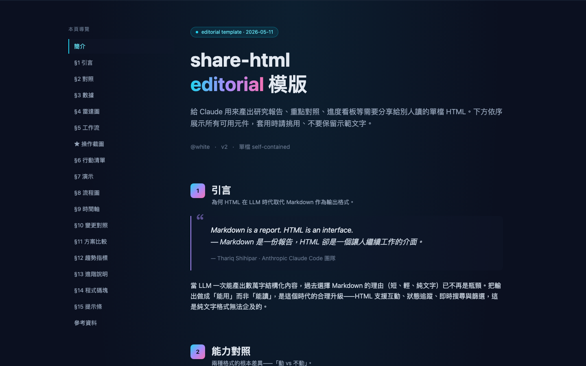
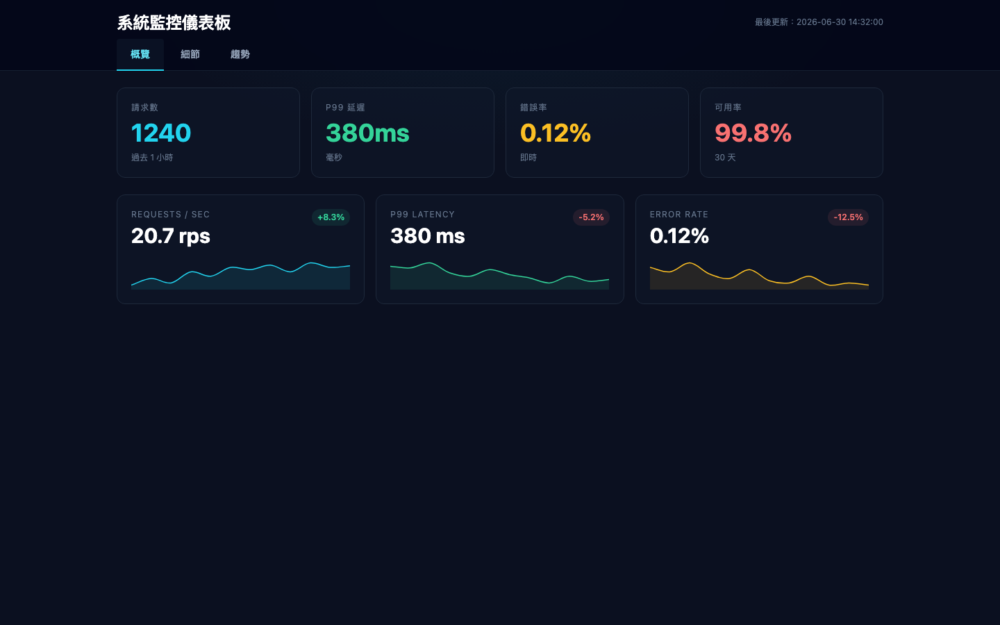
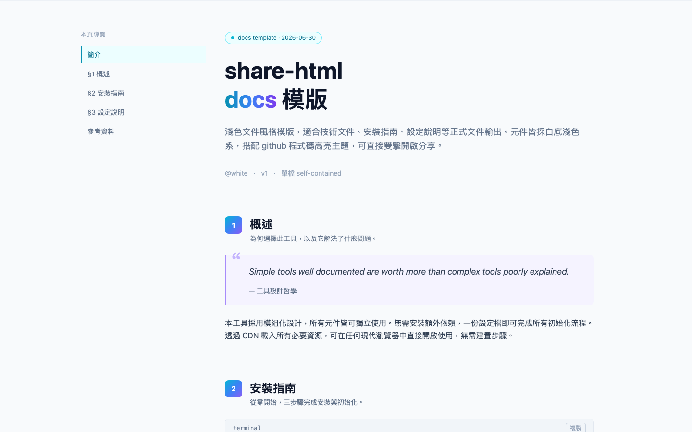
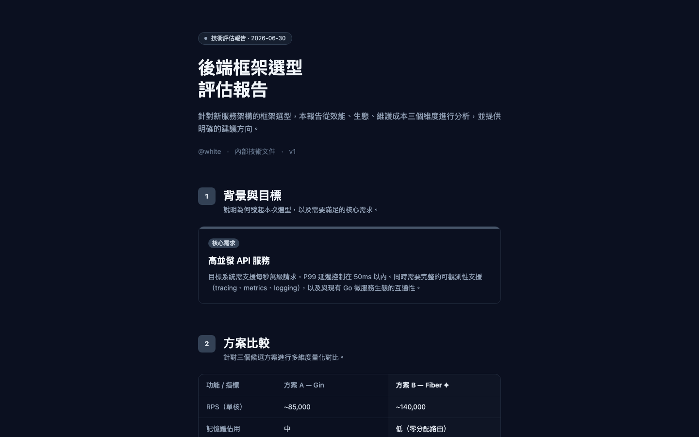
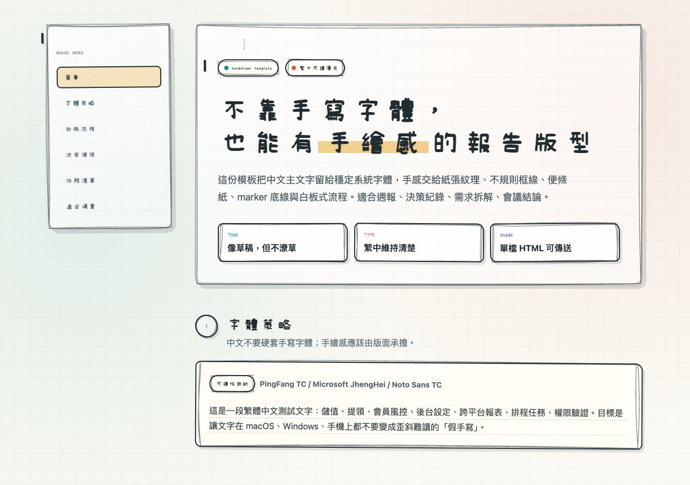

# share-html

Self-contained HTML templates for shareable reports. Double-click to open, drag to share — no build step, no server.

A [Claude Code](https://docs.anthropic.com/en/docs/claude-code) skill that generates single-file `.html` reports with interactive components, data visualization, and optional canvas effects.

## Install

```bash
npx skills add ggwhite/share-html
```

## Templates

### editorial (default)

Deep dark theme with sticky TOC, gradient accents, and 18 interactive components. Best for research reports, code reviews, and comparative analysis.



- Sticky left TOC with scroll tracking
- Searchable/filterable data tables
- Drag-and-drop Kanban boards
- Chart.js radar charts and sparklines
- Interactive checklists with progress bars

### briefing

Full-page slides with warm amber tones. Each section fills the viewport with large text and key metrics. Built for weekly reports and executive summaries.


- One section per screen with scroll snap
- Bottom dot navigation
- Animated stat counters
- Warm amber/orange/rose gradient accents

### dashboard

Tab-based data dashboard with dense grid layouts. Three panels — overview, detail, and trends — packed with metrics, charts, and tables.



- Tab switching with lazy chart initialization
- Dense grid layouts (2-3 columns)
- Radar charts, sparklines, and data tables
- Real-time-style timestamp display

### docs

Light theme for technical documentation. Same dual-column TOC layout as editorial, but with a clean white background and GitHub-style code highlighting.



- Light background (`#f8fafc`)
- GitHub code highlighting theme
- Collapsible FAQ sections
- Cyan/blue/violet accent gradient

### minimal

Stripped-down single column, no TOC, no progress bar. Just the content, centered and clean. For when you need to share one conclusion or comparison fast.



- `max-w-2xl` centered layout
- No gradients, muted slate palette
- Minimal JavaScript footprint

### handdrawn

Notebook/whiteboard style for meeting notes, decision records, requirement breakdowns, and workshop summaries. The template uses JasonHandwriting for Traditional Chinese headings and short labels, Rough.js for sketchy borders, and stable system fonts for longer paragraphs.



- Traditional Chinese handwriting on headings, labels, TOC, and checklist text
- Rough.js sketch borders, marker underline, sticky notes, and whiteboard flow blocks
- Lightweight Alpine interactions for TOC and checklist

## Canvas Effects

Nine optional visual effects you can drop into any template. Add them to `<body>` before your content.

| Effect | File | Weight | Description |
|--------|------|--------|-------------|
| gradient-flow | `effects/gradient-flow.html` | Light | Drifting color blobs with CSS blur |
| cursor-glow | `effects/cursor-glow.html` | Light | Mouse-following radial glow |
| particles | `effects/particles.html` | Medium | Floating particles with connecting lines |
| parallax-depth | `effects/parallax-depth.html` | Medium | Three-layer scroll parallax |
| matrix-rain | `effects/matrix-rain.html` | Medium | Katakana/number rain effect |
| morphing-blobs | `effects/morphing-blobs.html` | Medium | Organic shape-shifting blobs |
| flow-field | `effects/flow-field.html` | Heavy | Perlin noise particle flow |
| aurora | `effects/aurora.html` | Heavy | Northern lights wave bands |
| metaballs | `effects/metaballs.html` | Heavy | Merging color spheres |

All effects respect `prefers-reduced-motion` and pause when the tab is hidden.

## Usage

Once installed, trigger the skill in Claude Code with:

- 「做 HTML 給別人看」
- 「產一份報告」
- 「套我的 template」
- 「用 share-html」

Claude will pick the best template based on your content, or you can specify one directly.

## Tech Stack

- [Tailwind CSS](https://tailwindcss.com/) (CDN)
- [Alpine.js](https://alpinejs.dev/) (CDN)
- [Chart.js](https://www.chartjs.org/) (CDN, only when needed)
- [highlight.js](https://highlightjs.org/) (CDN, only when needed)
- Canvas 2D API (effects only)

Zero build step. Zero dependencies. Every output is a single `.html` file.

## License

[MIT](LICENSE)
